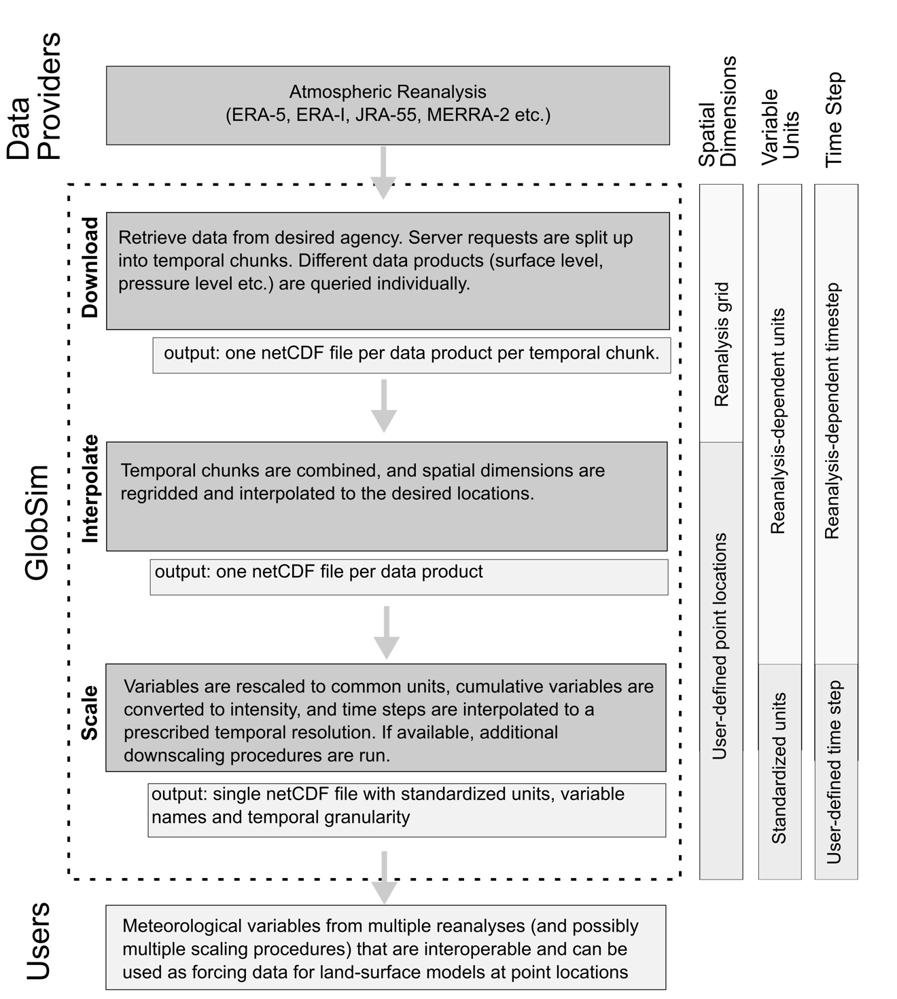

Introduction
=============

GlobSim is developed to efficiently download, process and downscale currently available global atmospheric reanalysis data products, which include ERA_Interim from the European Centre for Medium-Range Weather Forecasts (ECMWF), MERRA2 from the National Aeronautics and Space Administration (NASA), and JRA55 from the Japan Meteorological Agency (JMA). 

.. note::  Because of the dependency on ESMF libraries, GlobSim is only supported on Linux. However, Windows and Mac users can run GlobSim through Docker using the instructions provided here.

Guide
-----

The desired meteorological information is specified using simple control files, which prescribe coordinates of sites, elevation, time period, variable lists, and scaling parameters. GlobSim then produces the interpolated and downscaled time series for the specified sites. These output files are saved in the format of netCDF4 and can be utilized directly, or after conversion to specific ASCII conventions, as part of the input for permafrost-enabled models, such as GEOtop, NEST, Surfex, CLM, etc. 

For each reanalysis, GlobSim has three main modules: (1) A set of downloaders to obtain the desired meteorological variables over the specified area. The outputs are saved in a given directory as netCDF files while keeping all of the original conventions (spatial and temporal grids, variable names, units) of the respective reanalysis. (2) A set of interpolators to derive variables for the specified target locations while retaining all other original conventions from the reanalyses (temporal grid, variable names, units), output in netCDF4 format. (3) A set of scaling functions to derive the desired variables individually. This step results unified units, variable names, and temporal granularity. Variables are disaggregated from large grids (spatial resolutions on the order of 100 km) for application to point locations or to small grid cells on the order of 10m.

  
For more information
---------------------
Coming soon! 